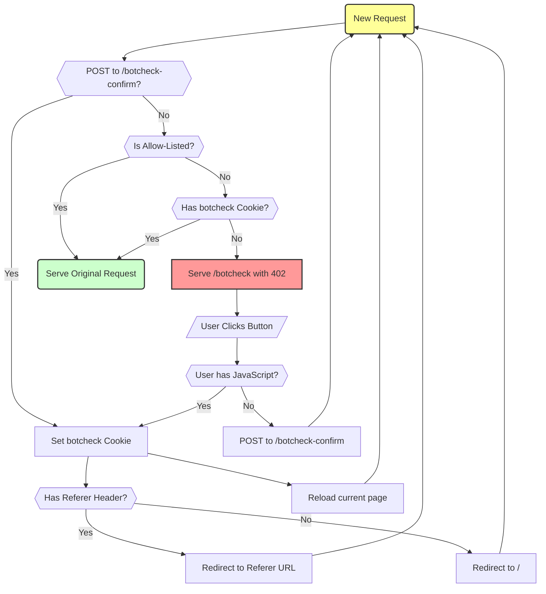

# Apache Anti-Bot Challenge

This is a simple Apache setup to fight excessive bot traffic. The idea is simple: if a request is made without a proper cookie, present a simple page with a button. When the button is clicked, the cookie is set and future requests are allowed through. Legitimate users will click the button, while most bots will not.

Unlike other, similar solutions this one is designed to be easy to deploy and setup with an existing Apache server without the need of a reverse proxy or complex dependencies. Also unlike many other solutions it also optionally works with JavaScript disabled.

The handling is mostly done by mod_rewrite and a small Go helper program that performs fast lookups against multiple allow lists.

## Setup

Download the tarball from the releases page and extract it somewhere on your server. Then in your Virtual Host or main Apache config file define the `BOTCHECK_DIR` variable to point at the extracted folder and include the `botcheck.conf` file. Finally, edit the allow lists to suit your needs.

```apache
# Anti Bot Check
Define BOTCHECK_DIR /home/andi/projects/botcheck/apache
Include ${BOTCHECK_DIR}/botcheck.conf
```

Note that this setup does not work in `.htaccess` because the `RewriteMap` directive is not allowed there. Be sure to have the `mod_rewrite` and `mod_headers` modules enabled in Apache.

## Allow Lists

The configuration will allow in requests that match either the IP/CIDR list in `addresses.net.list` or the User-Agent regex (case-insensitive) list in `useragents.ri.list`. You can edit these files to add your own rules. Requests to certain paths can be excluded from the bot check by adding regexes (case-sensitive) to `pathexcludes.re.list`.

It is recommended to let in the known IP ranges of search engine crawlers and other good bots in `addresses.net.list`. You can find up-to-date lists of crawler IPs from various sources on the web. The `update-bot-addresses.sh` script will automatically download and update a list of known crawlers. Check the top of the script for the sources it uses. The script requires `curl` and `jq` to run.

## How it works

The below chart visualizes the request flow through the botcheck system. A new request without the proper cookie is served the botcheck page with a 402 status code. If the user clicks the button, the cookie is set and the page is reloaded. If JavaScript is disabled, a POST request is made to confirm the botcheck instead. Once the cookie is set, future requests are allowed through.



## Why Status 402?

HTTP Status 402 means "Payment Required". The more proper status code for this use case would be 403 (Forbidden) or 401 (Unauthorized), but Apache does not let us serve a custom HTML page with an arbitrary status code using mod_rewrite. It can only be achieved with the ErrorDocument directive, but we do not want to globally override the 401/403 error pages for the entire server. Unless you are actually using a default 402 error page for something else, this should not cause any issues and is still in the 400 range of client errors.

Or you can think of it as a "payment" of clicking a button to prove you are human!

## Lookup Helper

To make it easy to configure allow lists the RewriteMap feature of mod_rewrite is used. But since we want to support regular expressions and CIDR notation for IPs, a custom helper program is needed. The `lookup` helper is written in Go and supports fast lookups against multiple list files that can be reloaded on the fly without restarting Apache.

Check the [lookup/README.md](lookup/README.md) file for more details about the protocol and how to build and test the helper.

## Checking your logs

There's a `check402.py` Python script in this repository which can be used to analyze your Apache access log. It will list all IPs that received a 402 status response without ever passing the botcheck. With each IP the number of requests and the User-Agent strings associated with it are shown. This can help you identify persistent bots that you might want to block on the firewall level or add to your allow lists.

## License

Copyright 2025 Andreas Gohr <andi@splitbrain.org>

Permission is hereby granted, free of charge, to any person obtaining a copy of this software and associated documentation files (the “Software”), to deal in the Software without restriction, including without limitation the rights to use, copy, modify, merge, publish, distribute, sublicense, and/or sell copies of the Software, and to permit persons to whom the Software is furnished to do so, subject to the following conditions:

The above copyright notice and this permission notice shall be included in all copies or substantial portions of the Software.

THE SOFTWARE IS PROVIDED “AS IS”, WITHOUT WARRANTY OF ANY KIND, EXPRESS OR IMPLIED, INCLUDING BUT NOT LIMITED TO THE WARRANTIES OF MERCHANTABILITY, FITNESS FOR A PARTICULAR PURPOSE AND NONINFRINGEMENT. IN NO EVENT SHALL THE AUTHORS OR COPYRIGHT HOLDERS BE LIABLE FOR ANY CLAIM, DAMAGES OR OTHER LIABILITY, WHETHER IN AN ACTION OF CONTRACT, TORT OR OTHERWISE, ARISING FROM, OUT OF OR IN CONNECTION WITH THE SOFTWARE OR THE USE OR OTHER DEALINGS IN THE SOFTWARE.
