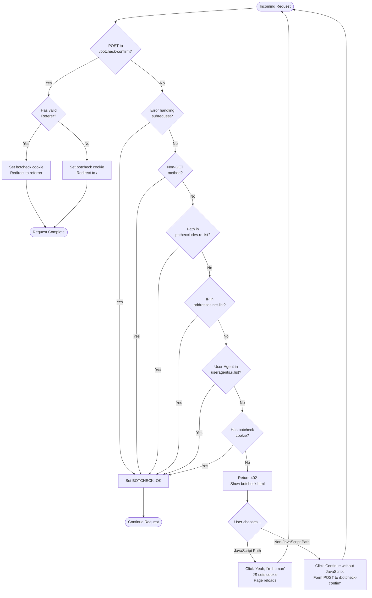

# Bot Check RewriteMap Helper

This repo bundles a tiny Apache setup that challenges suspicious traffic before letting it through. It contains:
- A Go `RewriteMap` helper that can evaluate many lookup lists in one long-running process.
- An Apache config snippet and static page that send questionable clients to a consent screen unless they match your allow lists.
- Example lists for IP/CIDR and User-Agent checks that you can edit for your own rules.

## How it works
- Apache loads `botcheck.conf` and defines `BOTCHECK_DIR` to point at the `apache/` folder (or the deployed copy of it).
- Only `GET` requests are subject to botcheck; other methods skip the challenge.
- The Rewrite rules call the `lookup` helper with either the visitor IP (`addresses.net.list`) or User-Agent (`useragents.ri.list`). If either is allowed, an env var `BOTCHECK=OK` is set and the request continues normally.
- Paths can be excluded from botcheck either via built-in rules (status, robots, etc.) or regexes listed in `pathexcludes.re.list`; matches also set `BOTCHECK=OK`.
- Requests without a match but carrying a `botcheck` cookie are also allowed. Everyone else is served `/botcheck.html` with HTTP 202 so humans can click through and set the cookie.
- Config files live next to the binary. The helper reloads them on-the-fly when their mtime changes, so you can edit lists without restarting Apache.

### Request Flow Diagram

## Repository layout
- `apache/botcheck.conf` — Apache include with the rewrite rules and helper wiring.
- `apache/botcheck.html` — Minimal consent page that sets the `botcheck` cookie.
- `apache/pathexcludes.re.list` — Regex patterns for request URIs that should bypass botcheck.
- `apache/*.list` — Example allow lists (`*.net.list` for IP/CIDR, `*.ri.list` for case-insensitive regex user-agents, `*.re.list` for case-sensitive regex, plain `*.list` for literal matches).
- `lookup/` — Go source for the RewriteMap helper; see `lookup/README.md` for protocol details.
- `Makefile` — Builds the helper into `apache/lookup` and runs tests.

## Build & test
- Build: `make lookup` (outputs `apache/lookup`).
- Test: `make test` (runs `go test ./...` inside `lookup/`).
- Clean: `make clean` (removes the built helper).

## Deploying with Apache
1. Build the helper and copy the `apache/` directory to your server.
2. Set an Apache `Define`, e.g. `Define BOTCHECK_DIR /opt/botcheck/apache`.
3. Include `botcheck.conf` from your main config or a vhost.
4. Edit `addresses.net.list` and `useragents.ri.list` to suit your allow rules (the helper reloads them automatically).
5. Customize `botcheck.html` if you want a different consent page.
